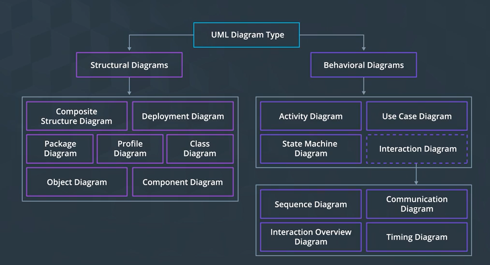
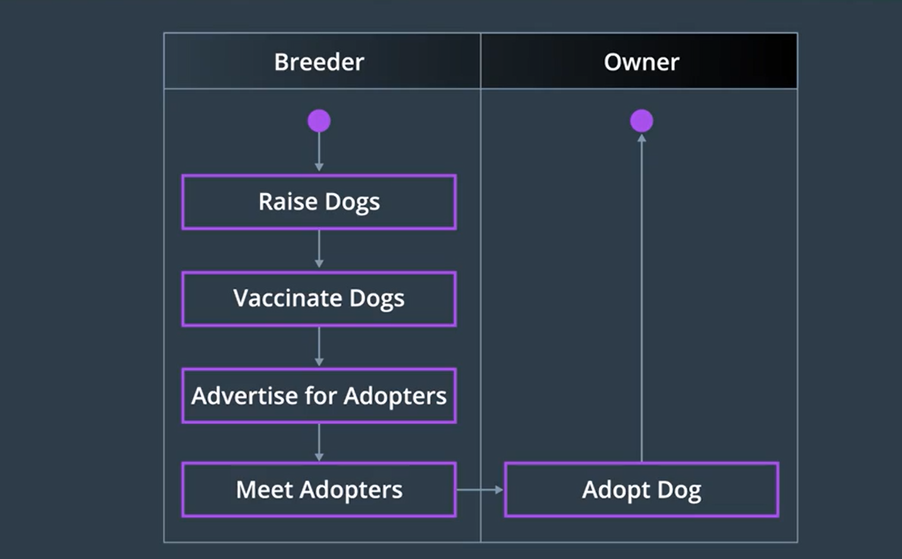
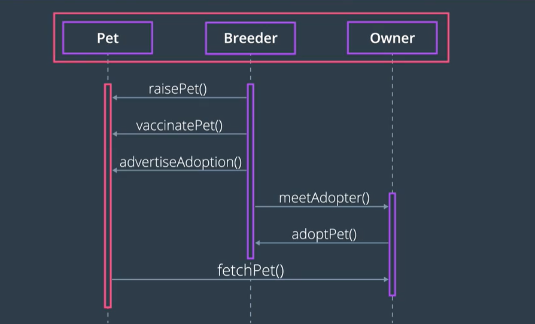
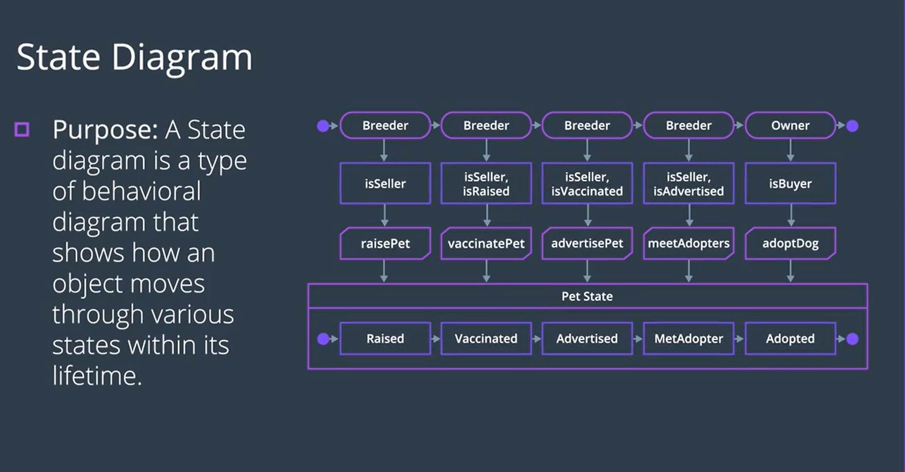
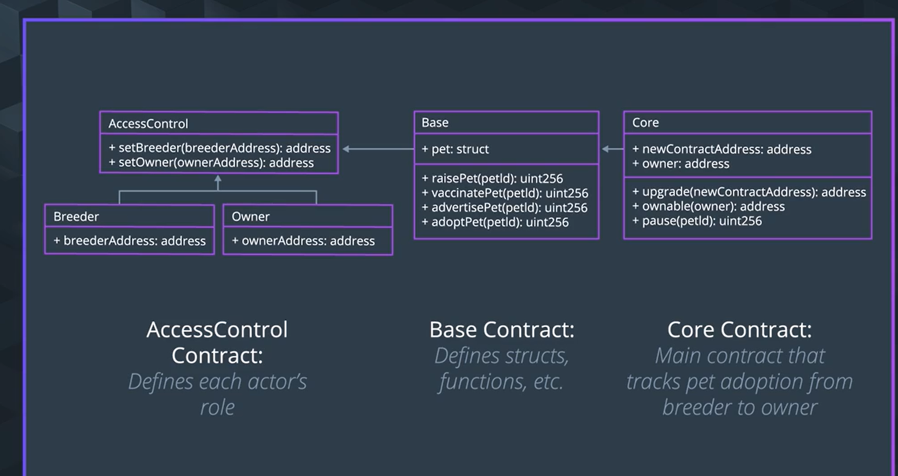
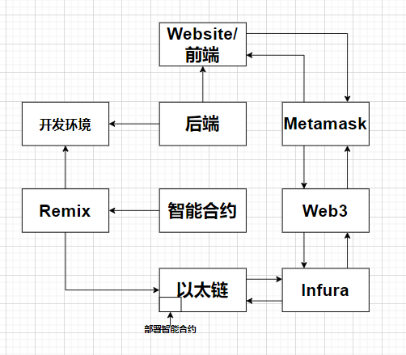
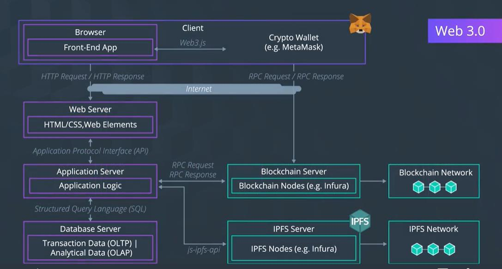

### UML `Unified Modeling Language diagrams`  
同样的架构设计就是相同的思考过程

---

直观展示系统中参与者 角色 动作 和数据  
高层次上主要分为两类 行为和结构   
在设计阶段 先行为 然后结构  
基于这个思考过程构建:活动,顺序,状态,类  
确定开发智能合约和数据库层的逻辑  

- `Activity`[活动图](https://www.lucidchart.com/pages/uml-activity-diagram) 参与者&交互

- `Sequence` [序列图](https://www.youtube.com/watch?v=pCK6prSq8aw) : 对象 行为 functions

- `State`状态图： `资产状态的枚举`

- [类图](https://www.youtube.com/watch?v=UI6lqHOVHic) 确定存储在区块链或者传统DB中的数据结构

## 定义
应用程序是现实世界的实体和信息的表示 
- 资产- 任何需要跟踪的物理或数字实体（房地产、教育、石油/天然气、运输、医保）
  - 属性 资产（what）、所有权（who）、时间（when）和位置（where）
- 业务流程 资产通过为证据线索记录的业务流程的各个步骤的进展。  
智能合约在链上执行业务流程以遏制流氓行为
    - 业务操作- 用户或机器启动的操作，允许资产从一个流程状态进展到下一个流程状态
- 参与者
  - 与资产交互以执行流程操作并将资产从一种状态转换为下一种状态的用户。  
  拥有资产所有权或保管权的用户。参与资产审计、审查和证明以验证历史记录的用户。

## 工具
  
- [LucidChart](https://www.lucidchart.com/) 
- [draw.io](https://www.draw.io/)  

> 活动图

系统中一个活动流向另一个活动,它捕捉系统的动态行为  
用泳道(swim lanes) 在视觉上明确哪个参与者负责哪个步骤  
参与者&行为(业务流程)

文章: 
- https://www.visual-paradigm.com/guide/uml-unified-modeling-language/what-is-activity-diagram
- [resource](https://www.lucidchart.com/pages/uml-activity-diagram)

> 序列图

文章
- https://www.ibm.com/developerworks/rational/library/3101.html
- https://www.geeksforgeeks.org/unified-modeling-language-uml-sequence-diagrams/
- https://www.ibm.com/developerworks/rational/library/3101.html
- [resource](https://www.lucidchart.com/pages/how-to-draw-a-sequence-diagram-in-UML?a=1)

> 状态图

文章:https://www.smartdraw.com/state-diagram/#:~:text=A%20state%20diagram%20shows%20the,or%20a%20state%20machine%20diagram

说明: 逐行代表的意思:角色,条件,函数,状态
> 数模图  

确定数据库结构(存储在区块链还是DB)  
[resource](https://www.lucidchart.com/pages/uml-class-diagram)

> 其它

